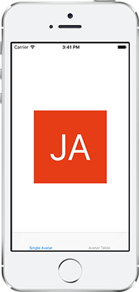
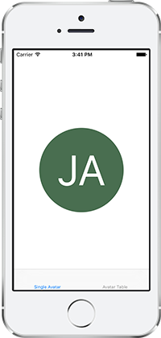
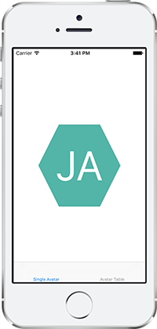
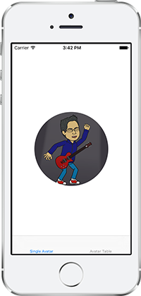
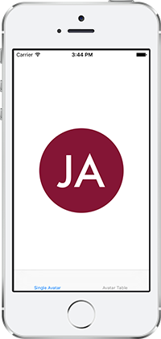
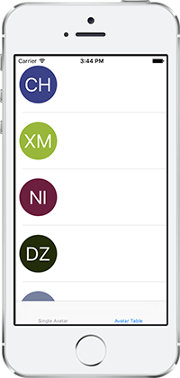

MIT License 2020

## Description

The NDAvatar framework provides a unified way of setting and displaying user avatars based on their name or profile picture. Customization options include adding a border, border width, and border color, as well as setting the frame's corner radius or creating a circular mask. You can see the framework in use with NDAvatarApp

[NDAvatarApp](https://github.com/neone/NDAvatarApp)

## Based on

https://github.com/ayushn21/AvatarImageView

## Usage

To set up `AvatarImageView`, a `dataSource` that conforms to `AvatarImageViewDataSource` needs to be set. Optionally a `configuration` that conforms to `AvatarImageViewConfiguration` can also be set. The default configuration will show a square picture; and if no profile picture is supplied, it will draw the initials with the system font on a random background color.

The `AvatarImageViewDataSource` contains the following members. All have default implementations and are hence optional.

* `var name: String { get }` - Default: returns `""`
* `var avatar: UIImage? { get }` - Default: returns `nil`
* `var bgColor: UIColor? { get }` - Default: returns `nil` 
* `var initials: String { get }` - Default: returns initials calculated from the name.
* `var avatarId: Int { get }` - Default: returns the hash values of the name and initials combined using XOR.

The `AvatarImageViewConfiguration` contains the following members. All have default implementations and are hence optional.

* `var shape: Shape { get }` - Default: returns `.Square`
* `var textSizeFactor: CGFloat { get }` - Default: returns `0.5`
* `var fontName: String? { get }` - Default: returns `nil` 
* `var bgColor: UIColor? { get }` - Default: returns in`nil`. The `bgColor` in `AvatarImageViewDataSource` will take precedence over this one.
* `var textColor: UIColor { get }` - Default: returns `.white`.

Check out the [docs](http://cocoadocs.org/docsets/AvatarImageView/) for more information.

The random background colour is generated for each unique user from its `avatarId`, so if you have `AvatarImageView`s in different parts of your app, the background color for a particular user will be the same in both.

The image view can be drawn as a square or circle out of the box. You can even sepcify a mask image if you want a custom shape. These settings are done in an `AvatarImageViewConfiguration`. Here are some examples for initials being drawn in different shapes.

Here's an example of when the `dataSource` supplies a profile picture and the `configuration` is set to a circle.

It works great with custom fonts!

...and also with `UITableView`s

## Documentation

## Requirements

NDBiometrics requires at least iOS 12. 

## Installation

To install the NDBiometrics framework in your app simply add it to the Swift Packages of your project settings. No pods, no command line tools. Just a Swift Package :)

## Release Notes

#### 1.0
Initial release

## Authors

Dave Glassco, [GitHub](https://github.com/neodave), Web: [Neone](https://www.neone.com), Twitter: [@daveglassco](https://twitter.com/daveglassco)  
Chris Corea, [GitHub](https://github.com/Chris-Corea)

## License

The NDBiometrics framework is available under the MIT license. See the LICENSE.md file for more info.
